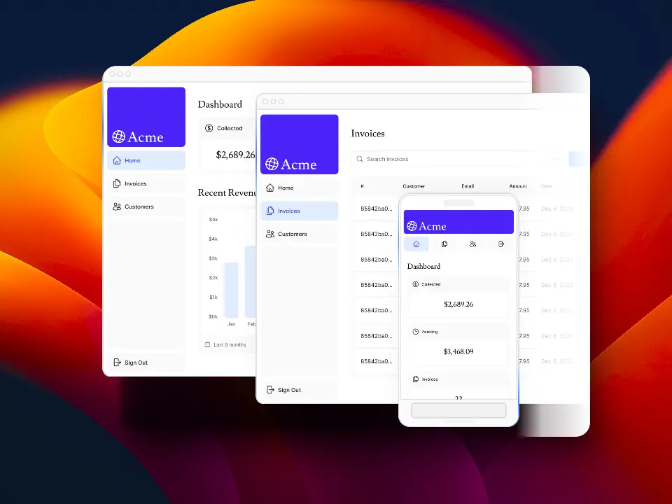
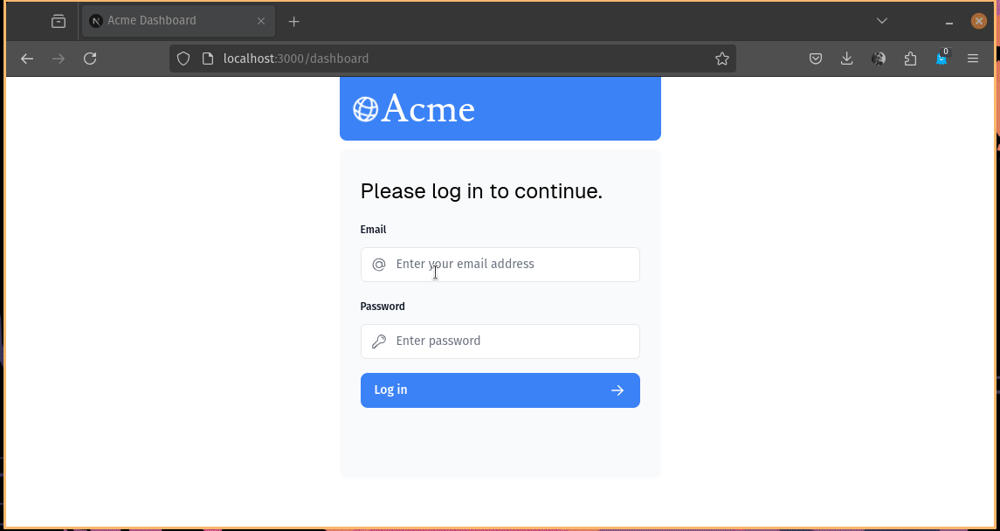

📋 Acme Dashboard
=================

This is a [Next.js](https://nextjs.org) project bootstrapped with [`create-next-app`](https://nextjs.org/docs/app/api-reference/cli/create-next-app).

Project follows the instructions shared in [NextJS Learn](https://nextjs.org/learn), to build an dashboard application for revenues, invoices and customers management.



🚀 Getting Started
------------------

First, run the development server:

```bash
pnpm dev
```

Open [http://localhost:3000](http://localhost:3000) with your browser to see the result.

You can start editing the page by modifying `app/page.tsx`. The page auto-updates as you edit the file.

This project uses [`next/font`](https://nextjs.org/docs/app/building-your-application/optimizing/fonts) to automatically optimize and load [Geist](https://vercel.com/font), a new font family for Vercel.

🤓 Learn More
-------------

To learn more about Next.js, take a look at the following resources:

- [Next.js Documentation](https://nextjs.org/docs) - learn about Next.js features and API.
- [Learn Next.js](https://nextjs.org/learn) - an interactive Next.js tutorial.

You can check out [the Next.js GitHub repository](https://github.com/vercel/next.js) - your feedback and contributions are welcome!

🔻 Deploy on Vercel
-------------------

The easiest way to deploy your Next.js app is to use the [Vercel Platform](https://vercel.com/new?utm_medium=default-template&filter=next.js&utm_source=create-next-app&utm_campaign=create-next-app-readme) from the creators of Next.js.

Check out our [Next.js deployment documentation](https://nextjs.org/docs/app/building-your-application/deploying) for more details.

✅ Requirements
---------------

- Knowledge in JavaScript.
- Knowledge in React.
- Knowledge in TypeScript.
- NodeJS greater than v.18.
- Vercel's account.

🗂️ Index
--------

- Layout.
- Styling.
- Assets Optimizations.
- Routing.
- Fetching Data.
- Static and Dynamic Rendering.
- Streaming.
- Pre-render.
- Error Handling.
- Authentication.
- `use client` y `use server`

⏺️ Summary
----------

To recap, you've done a few things to optimize data fetching in your application:

- Created a database in the same region as your application code to reduce latency between your server and database.
- Fetched data on the server with React Server Components. This allows you to keep expensive data fetches and logic on the server, reduces the client-side JavaScript bundle, and prevents your database secrets from being exposed to the client.
- Used SQL to only fetch the data you needed, reducing the amount of data transferred for each request and the amount of JavaScript needed to transform the data in-memory.
- Parallelize data fetching with JavaScript - where it made sense to do so.
- Implemented Streaming to prevent slow data requests from blocking your whole page, and to allow the user to start interacting with the UI without waiting for everything to load.
- Move data fetching down to the components that need it, thus isolating which parts of your routes should be dynamic.

Below, a gif with the app navigation.


