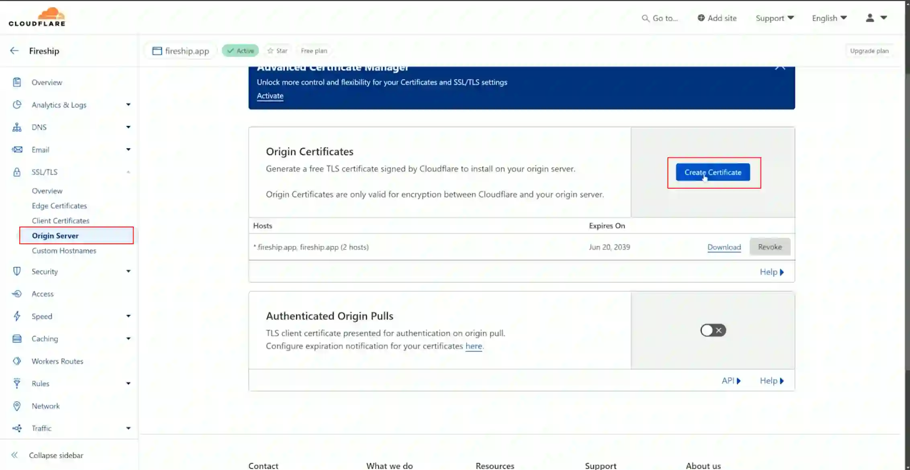
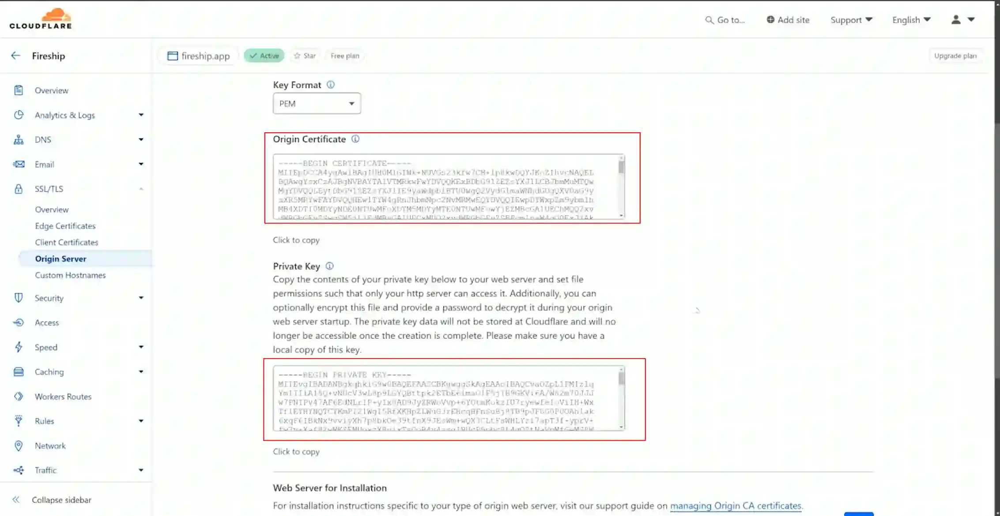

# Guestbook

Proyecto para sintetizar los contenidos en [The Full Linux Self-hosting Course](https://fireship.dev/linux).

## Paso 1: Servidor Virtual Privado (VPS)

Un servidor virtual privado es una máquina Linux con alguna dirección IP en el internet capaz de almacenar aplicaciones web. A continuación se comparten alternativas de VPS.

Opciones Popular VPS Hosting

- [Akamai Cloud](https://www.linode.com) (previamente Linode)
- [Vultr](https://www.vultr.com)
- [Digital Ocean](https://www.digitalocean.com)

Opciones Big Cloud

- AWS EC2
- Google Compute Engine
- Azure Virtual Machines

Dentro de estas pociones tenemos algunos tipos de VPS:

- **Optimizados para computación en la nube - CPU (Unidades Centrales de Procesamiento) dedicado**: Máquinas virtuales para aplicaciones de negocios con demanda e.g., sitios web productivos, CI/CD, transcodificación de videos, ó bases de datos enormes.
- **Computación en la nube - CPU compartida**: Máquinas virtuales para aplicaciones con rendimiento explosivo e.g., trafico bajo, CMS, blogs, ambientes de pruebas, ó bases de datos pequeñas.
- **GPU en la nube**: Máquinas virtuales con GPUs (Unidades de Procesamiento Gráfico) fraccionadas o completas de NVIDIA para IA, machine learning, HPC, computación visual y VDI. También disponible como Bare Metal.
- **Bare Metal (Metal Desnudo)**: Servidor bare metal de un solo inquilino para aplicaciones con los requisitos de rendimiento o seguridad más exigentes.

El siguiente paso esta es escoger una distribución de sistema operativo. Entre las más populares tenemos Ubuntu, pero también suelen haber alternativas como Debian, FreeVSD, OpenBSD, Fedora, entre otros.

Luego tenemos la elección del plan para elegir capacidades en términos de:

- Número de núcleos e.g., 1 vCPU
- Memoria RAM e.g., 8 GB
- Almacenamiento e.g., 150 GB NVMe
- Ancho de banda e.g., 4 TB
- Precio ~$75/mes

Este plan tiene que adaptarse a las necesidades y consumes de nuestra aplicación web. Estas estimación bruta entre una aplicación NodeJS con una base de datos Postgres hace de 100 a 1000 peticiones por segundo. Para estos casos 1 vCPU y 8 GB de RAM puede ser suficiente.

El almacenamiento de la base de datos puede hacerse directamente en la VPS, pero no es lo recomendado. Lo mejor es utilizar un **bloque de almacenamiento** aparte. Por otro lado si queremos tener flexibilidad para agregar un almacenamiento escalable por demanda es recomendable utilizad un **objeto de almacenamiento**.

Hay funcionalidades adicionales como:

- Estrategia de back ups.
- Protección a DDoS (Ataques de Negación de Servicio). Hay herramientas como Cloudfare, que nos ofrece este servicio de manera gratuita.

## Paso 2: Secure Shell (SSH)

Una vez montada nuestra VPS, hay que configurar una llave SSH para conectarnos a ella. En pocas palabras, el secure shell es un protocolo que nos permite conectarnos desde nuestra máquina local al servidor remoto por medio de una llave y una terminal. Para ellos es necesario conocer la dirección IP del servidor remoto y un usuario raíz con acceso al mismo. Con dicha información se corre el siguiente comando:

```sh
ssh root@your.ip.address
```

Sin embargo, la recomendación es crear una pareja de llave pública y privada SSH para acceder al servidor sin necesidad de escribir la contraseña del usuario raíz y mejorar la seguridad al acceso del servidor remoto. Para crear la llave se ejecuta el siguiente comando:

```sh
ssh-keygen -t ed25519 -C "your_email@example.com"
```

en donde:

- `ssh-keygen`: es el comando
- `-t`: indica el algoritmos con el que se cifra la llave (e.g., `ed25518`)
- `-C`: bandera para indicar a que correo electrónico asociar la llave.

Este comando creara la pareja de llaves en el directorio `~/.ssh`. Copiamos el contenido de la llave pública con el comando:

```sh
pbcopy ~/.ssh/id_ed25519.pub
```
finalmente copiamos este valor en nuestro VPS.

## Paso 3: Construye la aplicación

Esta aplicación se compone de:

- Guestbook: una aplicación frontend en NextJS donde el usuario se registra con GitHub y su visita es guardada en el libro de invitados.
- Pocketbase: una aplicación backend con una base de datos SQL para almacenar los usuarios que visitan la página. Pocketbase ofrece una interfaz de usuario para el rol de administrador y así administrar los datos.

## Paso 4: Networking y Firewall

Por defecto, los accesos a los servidores remotos son muy limitados para garantizar seguridad. Los accesos utilizan los puertos asociados a protocolos para recibir mensajes esperados. Los siguientes puertos son abiertos para usos externos:

- `80` HTTP Cerrado
- `443` HTTPS Cerrado
- `22` SSH Abierto
- 
Estos puertos son solo de uso interno, i.e., por el  localhost:

- `3000` Next.js
- `8090` Pocketbase

Para abrir los puertos es necesario modificar el Firewall. El Firewall es la primera línea de defensa para el tráfico en red y define las reglas sobre cuales puertos están abiertos ó cerrados. En las páginas de los VPS hay opciones para administrar los grupos de firewall, pero una alternativa es la configuración del  **uncomplicated firewall** en el servidor remoto para habilitar los puertos 80 y 443 de los protocolos HTTP y HTTPS respectivamente. Para hacer esta configuración utilizamos NGINX.

## Paso 5: NGINX

Nginx es un servidor web que se puede usar como proxy inverso para enrutar el tráfico hacia aplicaciones web. Para configurar Nginx en nuestro servidor remoto, se ejecutan los siguientes comandos:

```sh
apt update
apt install nginx
systemctl start nginx // enable the service
systemctl enable nginx // run in background
systemctl status nginx // check if is runing
```

El `systemctl` es una utilidad de linux que nos permite prender y apagar servicios en nuestra máquina remota para que corran en un segundo plano. Al intentar navegar hacia `http://your.vps.ip.address` no se va a mostrar nada en esta ruta, y es allí donde la configuración del  **uncomplicated firewall** toma protagonismo con los siguientes comandos:

```sh
ufw status // see which ports are open
ufw app list // check what apps are available. Here you should see Nginx.
ufw allow 'Nginx Full' // add rule to use the Nginx Full
```

Ahora, al navegar `http://your.vps.ip.address` se verá el mensaje **Welcome to nginx!**.


## Paso 6: Transferencia de código

Al tener disponible tu servidor remoto, es momento de identificar una forma para trasferir el código de tu máquina local a la máquina remota. Existen varias alternativas:

- Copia segura con el comando `scp`. e.g., `scp -r /path/to/local/code root@123.45.67.89:/apps/guestbook`
- Protocolo FTP para la transferencia de archivo con FileZilla.
- git y GitHub.


En este paso vamos a usar **git**, ya que se puede clonar el repositorio en GitHub a tu máquina remota. git es una tecnología que merece un curso y por ende no se va a desarrollar a profundidad. En caso de no estar familiarizado con ella, se recomienda capacitarse en su uso. Por ahora, solo nos conformaremos con saber que es una estrategia para poner nuestro código en un servidor remoto.

Primero, se va a instalar node.js en la VPS por medio del Node Version Manager (`nvm`) con el siguiente comando:

```sh
curl -o- https://raw.githubusercontent.com/nvm-sh/nvm/v0.39.7/install.sh | bash
```

Este comando nos instala `nvm`. Para instalar node.js se ejecuta:

```sh
nvm install 20
```

Segundo, si usas tu propio código, primero tendrás que enviar tu código a un repositorio remoto en GitHub. Posteriormente podemos clonar el repositorio con el siguiente comando:

```sh
mkdir apps
cd apps
git clone https://github.com/fireship-io/linux-course guestbook
```

Tercero, instalamos las dependencias de la aplicación, y se ejecuta el build.

```sh
cd guestbook

npm install
npm run build
npm run star
```

Para validar que el frontend de la aplicación esta montada se puede usar el siguiente comando en otra terminal:

```sh
curl http://localhost:3000
```

Ahora vamos a ejecutar el backend de la aplicación en nuestro VPS. Abrimos otra pestaña en la terminal y se corren los siguientes comandos:

```sh
chmod +x pocketbase
./pocketbase serve
```

Para validar, en la consola el funcionamiento del backend, se debe ver en la terminal la siguiente salida:

```txt
Server started at http://127.0.0.1:8090
```

## Paso 7: Secure Sockets Layer (SSL)

Un certificado SSL es un documento digital que autentica la identidad de un sitio web y habilita una conexión cifrada. Es decir, los intercambios entre el cliente y el servidor estarán cifrados, hecho que nos da una garantía en seguridad ya que si un tercero intercepta la comunicación y obtiene la información que se transmite entre el cliente y el servidor, tendrá que descifrarla.

Hoy en día, si tu sitio web no cuenta con este certificado los navegadores compartirán una advertencia al usuario de que su conexión no es privada y estará expuesto a ataques para robar su información.

Los certificados SSL se pueden obtener de diferentes proveedores, algunos pagos y otros gratuitos en sitios como:

- [Let'encrypt](https://letsencrypt.org)
- [certbot](https://certbot.eff.org)
- [Cloudfare](https://www.cloudflare.com) ¡Gratuita!

Antes de certificar un sitio web, se debe tener un nombre de dominio para nuestro sitio web. Este se puede obtener en sitios como:

- GoDaddy
- Namechip
- Tudominio

Posteriomente, se debe transferir la funcionalidad de DNS a Claudefare siguiendo las instrucciones en su [documentación](https://developers.cloudflare.com/dns/zone-setups/full-setup/setup). De esta forma cuando los registros en el proxy DNS se hacen a través de Cloudefare para validar el certificado SSL y aplicar defense sobre ataques de negación de servicios.

Ahora, puede obtener el certificado SSL creando dicho certificado para el dominio en la sección SSL/TLS como muestra la siguiente imagen:



Una vez diligenciado el formulario, se van a obtener dos valores; **origin certificate** and **public key**.



Estos valores tienen que ser guardados en la siguiente directorio `/etc/ssl/` con bajo los archivo `cert.pem` y `key.pem` respectivamente. Para copiar el los valores se puede usar el editor de texto `nano`. 

```sh
nano /etc/ssl/cert.pem
nano /etc/ssl/key.pem
```

De esta forma se tiene el certificado SSL en nuestro servidor remoto.

## Paso 8: Direccionamiento del tráfico HTTP a HTTPS

Ahora para redireccionar todo el tráfico HTTP a HTTPS dado que ya hay certificado SSL hay que modificar el archivo `nginx.conf`. Por defecto, la configuración de este archivo es:

```txt
server {
    listen 80;
    server_name linux.fireship.app;
    
    # Redirect HTTP to HTTPS
    return 301 https://$server_name$request_uri;
}
```

Lo cuál significa que todo tráfico por el protocolo HTTPS obtendrá como respuesta un `301 movido permanentemente`, estado que indica que ese recurso se ha movido de manera permanente a una nueva URI, y esta especificada en el encabezado `Location` de la respuesta.

Para habilitar el tráfico a HTTPS se debe agregar la siguientes líneas al `nginx.conf`:

```txt
server {
    listen 443 ssl;
    server_name linux.fireship.app;

    # SSL configuration using Cloudflare certificates
    ssl_certificate /etc/ssl/cert.pem;
    ssl_certificate_key /etc/ssl/key.pem;

    # SSL settings (recommended for security)
    ssl_protocols TLSv1.2 TLSv1.3;
    ssl_prefer_server_ciphers on;
    ssl_ciphers ECDHE-ECDSA-AES128-GCM-SHA256:ECDHE-RSA-AES128-GCM-SHA256:ECDHE-ECDSA-AES256-GCM-SHA384:ECDHE-RSA-AES256-GCM-SHA384:ECDHE-ECDSA-CHACHA20-POLY1305:ECDHE-RSA-CHACHA20-POLY1305:DHE-RSA-AES128-GCM-SHA256:DHE-RSA-AES256-GCM-SHA384;

    # Next.js application
    location / {
        proxy_pass http://localhost:3000;
        proxy_http_version 1.1;
        proxy_set_header Upgrade $http_upgrade;
        proxy_set_header Connection 'upgrade';
        proxy_set_header Host $host;
        proxy_cache_bypass $http_upgrade;
    }

    # PocketBase API and Admin UI
    location /pb/ {
        rewrite ^/pb(/.*)$ $1 break;
        proxy_pass http://localhost:8090;
        proxy_http_version 1.1;
        proxy_set_header Upgrade $http_upgrade;
        proxy_set_header Connection 'upgrade';
        proxy_set_header Host $host;
        proxy_cache_bypass $http_upgrade;
    }
}
```

Demasiada información, vamos por partes:

```txt
    listen 443 ssl;
    server_name linux.fireship.app;

    # SSL configuration using Cloudflare certificates
    ssl_certificate /etc/ssl/cert.pem;
    ssl_certificate_key /etc/ssl/key.pem;
```

Estás líneas indican que todo el trafico por el puerto `443` que es el puerto correspondiente al protocolo HTTP será abierto con un certificado SSL y se especifican los archivos que se generaron en Cloudefare.

```txt
    # SSL settings (recommended for security)
    ssl_protocols TLSv1.2 TLSv1.3;
    ssl_prefer_server_ciphers on;
    ssl_ciphers ECDHE-ECDSA-AES128-GCM-SHA256:ECDHE-RSA-AES128-GCM-SHA256:ECDHE-ECDSA-AES256-GCM-SHA384:ECDHE-RSA-AES256-GCM-SHA384:ECDHE-ECDSA-CHACHA20-POLY1305:ECDHE-RSA-CHACHA20-POLY1305:DHE-RSA-AES128-GCM-SHA256:DHE-RSA-AES256-GCM-SHA384;
```

Estás líneas son configuraciones de seguridad a través de algoritmos de cifrado y protocolos. Se puede revisar la sección [Cipher suites](https://developers.cloudflare.com/ssl/edge-certificates/additional-options/cipher-suites/) de Cloudfare para más contexto.

```txt
    # Next.js application
    location / {
        proxy_pass http://localhost:3000;
        proxy_http_version 1.1;
        proxy_set_header Upgrade $http_upgrade;
        proxy_set_header Connection 'upgrade';
        proxy_set_header Host $host;
        proxy_cache_bypass $http_upgrade;
    }

    # PocketBase API and Admin UI
    location /pb/ {
        rewrite ^/pb(/.*)$ $1 break;
        proxy_pass http://localhost:8090;
        proxy_http_version 1.1;
        proxy_set_header Upgrade $http_upgrade;
        proxy_set_header Connection 'upgrade';
        proxy_set_header Host $host;
        proxy_cache_bypass $http_upgrade;
    }
```

Por último, estás lineas son configuraciones sobre nuestras aplicaciones frontend y backend respectivamente. La configuración importante es que cuando el usuario navegue a la raíz `/` sera redirigida a la aplicación Next.js. Al navegar a `/pb` pasará por nuestra aplicación de Pocketbase.

El siguiente paso es contarle a nginx que hubo una actualización en el archivo de configuración. Para ello se ejecuta:

```sh
nano /etc/nginx/sites-available/guestbook
```

Y copiamos todo el archivo `nginx.conf` allí.

Luego, se crea el siguiente enlace simbólico, para especificarle a nginx cual és la configuración relevante:

```sh
ln -s /etc/nginx/sites-available/guestbook /etc/nginx/sites-enabled/
```

Se borra la configuración por defecto, ya que no se está utilizando:

```sh
rm /etc/nginx/sites-enabled/default
```

Validamos que todo esta bien en nginx con el comando:

```sh
nginx -t
```

Y por último se recarga el servidor de nginx, para cargar la nueva configuración:

```sh
systemctl reload nginx
```

Ahora al visitar el dominio, se deberá visualizar la webapp.

## Paso 9: Variables de entorno

Nuestra webapp ya esta visible en la VPS, pero su configuración está algo incompleta, ya que si la máquina remota se reinicia, se pierden los valores de las configuraciones que requiere nuestra aplicación

Para tener configuraciones persistentes de información delicada (e.g., llaves para conexión a APIs) en el servidor se usan variables de entorno. En Linux hay varias formas de configurar variables de entorno.

La primera alternativa es configurar la variable de entorno de manera temporal durante la vida de una sesión en el shell:

```sh
export FOO="bar"
```

La segunda alternativa es actualizar el `.bashrc` o el `.bash_profile` para definir la variable antes de cada sesión en el shell:

```sh
nano ~/.bashrc
export FOO="bar"
```

La tercera alternativa es definir la variable de entorno de manera permanente en el ambiente del sistema:

```sh
nano /etc/environment
export FOO="bar"
```

Por último esta la alternativa más flexible de todas y es a través de un archivo `.env` en alguno de los directorios de tus proyectos. Esto implica que el proyecto usa una biblioteca como `dotenv` en Node.js para leer el valor. Y es la más flexible porque permite atender el escenario de tener varias aplicaciones en la misma máquina remota.

## Paso 10: systemd

El otro problema que se enfrenta es que si la máquina remota se reinicia, hay que correr manualmente los comandos para levantar la aplicación.

Para automatizar estos comandos, se puede usar el `systemd`. systemd es un conjunto de bloques básicos para el sistema de Linux y provee un administrador de servicios para ejecutar tareas en paralelo al iniciar el sistema.

En ese orden de ideas, vamos a especificar las siguientes 3 tareas:

1. Reinicio automático
2. Logs personalizados
3. Establecer variables de entorno

Por defecto, el sistema operativo cuenta con varios archivos definidos en el `systemd` que se corren al arrancar el sistema. Para revisarlos se ejecuta el siguiente comando:

```sh
ls /etc/systemd/system/
```

El siguiente paso es agregar un par de servicios en esta carpeta. El primer servicio es para iniciar nuestra aplicación backend. Se usado `nano` para crear el archivo

```sh
nano /etc/systemd/system/pocketbase.service
``` 

Luego, agregamos el siguiente contenido:

```txt
[Unit]
Description=PocketBase

[Service]
Type=simple
User=root
Group=root
LimitNOFILE=4096
Restart=always
RestartSec=5s
StandardOutput=append:/var/log/pocketbase.log
StandardError=append:/var/log/pocketbase.log
ExecStart=/root/apps/guestbook/pocketbase serve --http="127.0.0.1:8090"
Environment="NEXT_PUBLIC_POCKETBASE_URL=https://linux.fireship.app/pb"

[Install]
WantedBy=multi-user.target
```

Como se puede observar, el archivo tiene 3 secciones, `Unit`, `Service` e `Install`. Toda la magia esta en la sección `Service`. Vamos a revisar configuraciones importantes:

```txt
Restart=always
RestartSec=5s
```

Estas líneas especifican que si la máquina remota se reinicia, este servicio también.

```txt
StandardOutput=append:/var/log/pocketbase.log
StandardError=append:/var/log/pocketbase.log
```

Estás lineas registrar errores del servicio en el archivo `/var/log/pocketbase.log`. Dicho archivo se va a crear más adelante.

```txt
ExecStart=/root/apps/guestbook/pocketbase serve --http="127.0.0.1:8090"
```

Está línea es la más importante, ya que es la que indica que comando correr para levantar la aplicación backend.

```txt
Environment="NEXT_PUBLIC_POCKETBASE_URL=https://linux.fireship.app/pb"
```

En la última linea de la sección de servicios, se define la variable de entorno relevante para la aplicación de Pocketbase.

Es tiempo de crear los archivos que almacenaran los logs, con los respectivos permisos de escritura:

```sh
touch /var/log/pocketbase.log
chmod 644 /var/log/pocketbase.log
```

De manera similar, se crea un servicio para el frontend en el siguiente archivo `/etc/systemd/system/nextjs.service` con el siguiente contenido:

```txt
[Unit]
Description=Next.js Application
After=network.target

[Service]
Type=simple
User=root
Group=root
Restart=always
RestartSec=5s
WorkingDirectory=/root/apps/guestbook
ExecStart=/bin/bash -c 'source /root/.nvm/nvm.sh && /root/.nvm/versions/node/v20.15.0/bin/npm start'
Environment="NODE_ENV=production"
Environment="NEXT_PUBLIC_POCKETBASE_URL=https://linux.fireship.app/pb"

[Install]
WantedBy=multi-user.target
```

La principal diferencia está en el `ExecStart` en donde se especifica el uso puntual de Node.JS.

Por último, con la utilidad `systemctl` se cargan estos servicio. Se ejecuta:

```sh
systemctl daemon-reload
```

Para recargar todos los procesos que se van a correr en paralelo al arrancar el sistema. Luego se ejecutan los comandos para iniciar y habilitar los servicios que acabamos de crear:

```sh
systemctl start pocketbase
systemctl enable pocketbase

systemctl start nextjs
systemctl enable nextjs
```

Y para validar su estado, se usa:

```sh
systemctl status pocketbase
systemctl status nextjs
```

## 🧰 Tool Kit

La siguiente lista recopila las tecnologías utilizadas en este proyecto.

- [tailwindcss](https://tailwindcss.com/), la forma rápida de construir sitios web sin nunca salir de su HTML; se utiliza en gran parte del proyecto.
- [NextJs](https://nextjs.org/), el Framework de React para la Web.
- [Pocketbase](https://pocketbase.io/), backend Open Source.
- [nginx](https://nginx.org/), a web server used as reverse proxy.


## 🧞 Comandos

Todos los comandos se corren desde la raíz del proyecto.

| Command            | Action                                            |
| ------------------ | ------------------------------------------------- |
| pnpm install       | Installs dependencies                             |
| pnpm run dev       | Starts local NextJS at localhost:3000             |
| pnpm run build     | Build your production site to ./dist/             |
| ./pocketbase serve | Starts the backend app at http://127.0.0.0.1:8090 |

Para correr el archivo pocketbase, es necesario habilitar los permisos, tal y como muestran los siguiente comandos.

```sh
sudo chmod +x pocketbase
./pocketbase serve
```